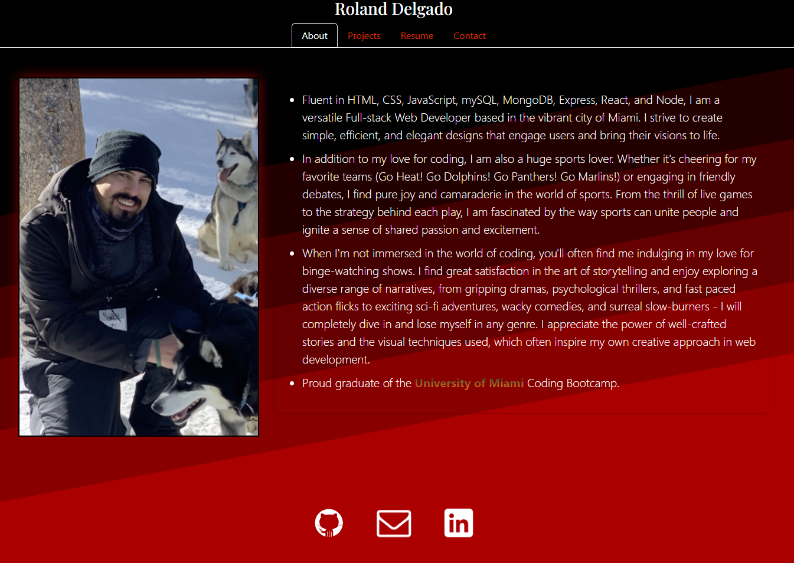

# React Portfolio (Module 20 Challenge)

## Description

My React Portfolio showcasing 6 of my projects with a downloadable Resume and a quick bio about me.  
Also includes a contact form to send me a message!

## Table of Contents

- [Installation](#installation)
- [Link](#link-to-deployed-application)
- [Credits](#credits)
- [License](#license)

## Installation

If you're wanting to download the source repo/code and running it locally:  
Install the node packages with "npm i" within the application directory.  
This will install all the necessary React libraries.  

Run "npm run develop" to automatically launch the default web browser and open the portfolio on the localhost server.  

### Link to deployed application

https://ohnoitsro.github.io/react-portfolio/

## Credits

Node.js for its CLI capabilities.  
https://nodejs.org/en/

React for its amazing user interfaces.  
https://react.dev/

Bootstrap for its beautiful custom designs.  
https://getbootstrap.com/

ESLint for its more descriptive, stricter and customizable restrictions.  
https://eslint.org/

## License

Please refer to the LICENSE in the repo.

---